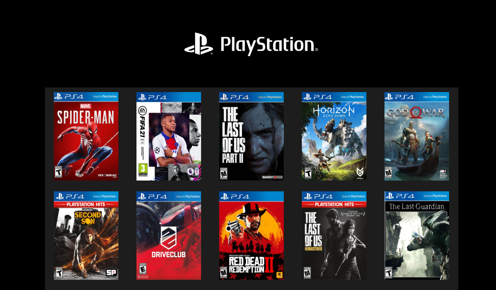

# Jogos de playstation
Estou aprendendo um pouco mais sobre responsividade e então resolvi me auto desafiar e explorar um pouco mais sobre o display grid com esse exercício.

[Você pode conferir como ficou o projeto aqui](https://joao121gf.github.io/galeria-de-jogos/)

## 🛠 Tecnologias
* HTML5
* CSS3

## Pré-requisitos
Antes de começar, você precisará ter os seguintes softwares instalados em sua máquina:

* Um editor de código (Ex: Visual Studio Code)

## Instalação
Para instalar e visualizar a tela de login, siga as seguintes etapas:

Clone o repositório do GitHub em sua máquina local.
Abra o arquivo index.html em seu editor de código.
Visualize o arquivo index.html em seu navegador.

## Personalização
Você pode personalizar a tela de login de acordo com suas necessidades, editando os arquivos index.html e style.css.

## Autor
João Giovani - https://github.com/joao121gf

## 💬Contato
* https://github.com/joao121gf
* https://www.linkedin.com/in/jo%C3%A3o-giovani-657192204/

## Licença
Este projeto está licenciado sob a licença MIT - consulte o arquivo LICENSE.md para obter detalhes.

